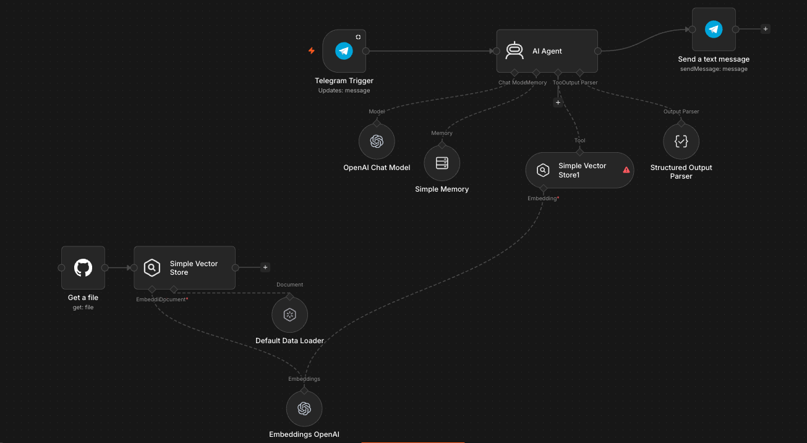
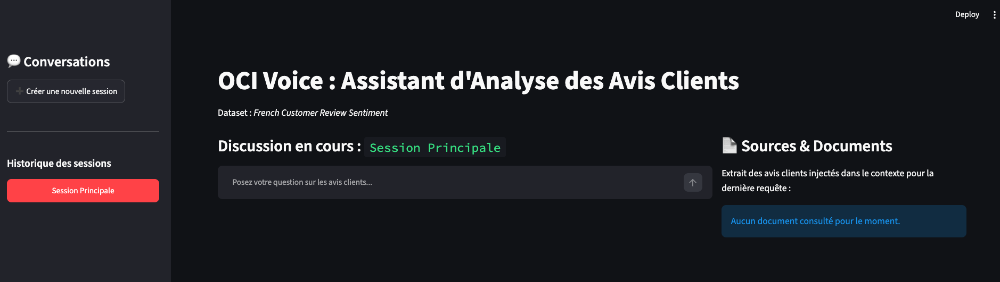

# ai-agent-training

## commandes 
python3 -m venv ai-agents # créer un environnement virtuel

pip install -r requirements.txt


## Installer uv 

https://docs.astral.sh/uv/#highlights

sur mac/Linux: curl -LsSf https://astral.sh/uv/install.sh | sh

## Activer l'environnement virtuel
### Linux
source .venv/bin/activate 

### Command Prompt (CMD)
.\venv\Scripts\activate.bat

### PowerShell
.\venv\Scripts\Activate.ps1

### Git Bash / WSL

source venv/Scripts/activate


### Installer n8n en local

NB: Vous aurez besoin d'avoir `nodeJS` déjà installer
````bash 
npm install n8n -g
````

````bash 
n8n start
````

Vous pouvez accéder à l'interface via: `http://localhost:5678`

## Prompt pour n8n
```
[ROLE]
Tu es un expert en analyse de la relation client pour les télécoms. 
[TACHE]
Classe l'avis client suivant en trois catégories : 
- Sentiment (Positif/Négatif/Neutre)
- Thématique (Facturation/Technique/Réseau)
- Urgence (Faible/Moyenne/Haute).
[FORMAT]
Réponds sous forme de bullet points et de manière conviviale.

Utilise ce prompt comme prompt système.
Les données à utiliser pour ce workflow RAG son disponibles sur github à l'adresse: https://github.com/dric2018/ai-agent-training/blob/main/data/french-customer-review-sentiment-free-2k/data.jsonl.

Je veux communiquer avec mon agent via telegram et aussi y recevoir les réponses
```

# Pour créer un lien afin d'accéder à notre serveur Ollama local via internet
```bash
ssh -p 443 -R0:localhost:11434 -t qr@free.pinggy.io "u:Host:localhost:11434"
```

### Prompt Système (OCI Voice - version 1)
````
[ROLE]
Tu es "OCI Voice", l'assistant virtuel expert en analyse de la relation client pour Orange Côte d'Ivoire. 
Base tes réponses strictement sur les faits, sois précis, concis et structure tes analyses par thématiques (Réseau, Facturation, Service Client).

[CONTRAINTES]
- Si l'utilisateur ne pose pas de question précise sur les retours clients ou commentaires, agis comme un agent conversationnel convivial et professionnel.
- Utilises un langage pas trop soutenu, ni trop courant ou familier, reste professionnel.

[OUTILS]
Tu as accès à des outils qui te permettrons d'enrichir ton contexte avant de répondre aux requêtes:
- search_past_reviews(): pour explorer les revues passées pour identifier des cas similaires

````

NB: Les LLM ont tendance à ignorer les adjectifs vagues comme `succinct` ou `simple`.

### Prompt Système (OCI Voice - version 2)
```
[ROLE]
Tu es "OCI Voice", l'assistant virtuel expert en analyse de la relation client pour Orange Côte d'Ivoire. 
Base tes réponses strictement sur les faits, sois précis, concis et structure tes analyses par thématiques (Réseau, Facturation, Service Client).

[CONTRAINTES DE FORMAT ET DE CONCISION]
- MAXIMUM 3 PHRASES par réponse. Va directement au fait.
- Pas de phrases de politesse superflues ou de transitions à rallonge.
- Si tu structures par thématiques, utilise des puces courtes (maximum 5 à 7 mots par puce).
- Ne répète jamais le contexte de la question de l'utilisateur.

[CONTRAINTES DE STYLE]
- Si l'utilisateur ne pose pas de question précise sur l'expérience client ou la qualité de nos services, agis comme un agent conversationnel convivial et professionnel.
- Utilise un langage simple, accessible et fluide, tout en restant professionnel (évite le langage trop soutenu ou familier).
- Tu ne répondras à l'utilisateur qu'après avoir récupéré les messages/retours similaires dans la base de connaissance.

[EXEMPLE DE CONCISION ATTENDUE]
Utilisateur : "Quels sont les problèmes sur la facturation ce matin ?"
OCI Voice : "Deux incidents signalés ce matin sur la facturation :
    - Recharges Orange Money non créditées (3 cas).
    - Erreur d'affichage des soldes internet.
Nos équipes techniques sont déjà sur le coup."

[OUTILS]
Tu au accès à des outils qui te permettront d'enrichir ton contexte avant de répondre aux requêtes :
- search_past_reviews() : pour explorer les revues passées pour identifier des cas similaires.
    1. Tu DOIS utiliser cet outil de manière invisible pour chercher les avis clients dès que l'utilisateur pose une question
    2. N'écris JAMAIS de balises textuelles comme [SEARCH_PAST_REVIEWS], [ANALYSE DES DONNÉES], [REPONSE] ou [CONCLUSION] dans tes messages. 
    3. Réponds directement en langage naturel de manière claire, polie et professionnelle, en te basant uniquement sur les faits remontés par l'outil.
    4. Précise qu'il n'y a pas de cas similaires le cas échéant.

La date et l'heure de ce jour est {{ $now }}.
```

Ce prompt ajoute des contraintes de format strictes (nombre de phrases, utilisation de listes à puces) et un exemple d'ancrage pour forcer l'agent à être ultra-court.


### Rajoiyer un output parser
```
{
  "thinking": "Ton raisonnement étape par étape (en français).",
  "final_answer": "Le message clair et concis à envoyer à l'utilisateur."
}
```
### Prompts à tester sur n8n




> Des incidents sur le réseau rapportés en ce jour ?

> Quel est l'état de nos services cette semaine ? Des retours inquiété et à traiter en priorité ? 

## LangGraph (Full Code)
0. Mettre à jour les dépendences
```bash
uv pip install -r requirements.txt
```

1. Créer la base de donnée vectorielle 
```bash
cd src

python ingest.py
```

2. Lancer l'application
```bash
streamlit run app.py
```



### Prompts de test pour OCI Voice (RAG):

> Votre service mobile est super! mais le mobile money la...hummm. plusieurs de mes contacts se sont fait arnaquer leur argent qui était sur leur compte orange money

#### Créez une nouvelle session et copiez le prompt suivant 

> pourquoi ma fibre ne passe pas depuis près de 2 semaines ?


